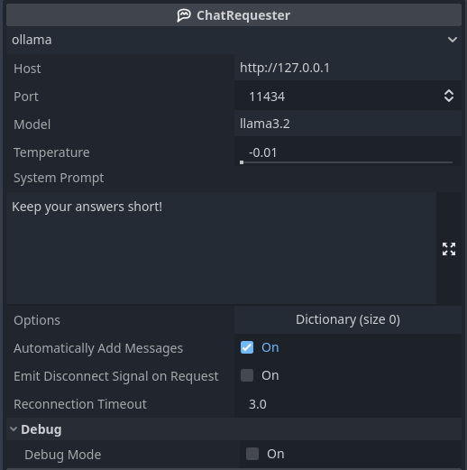
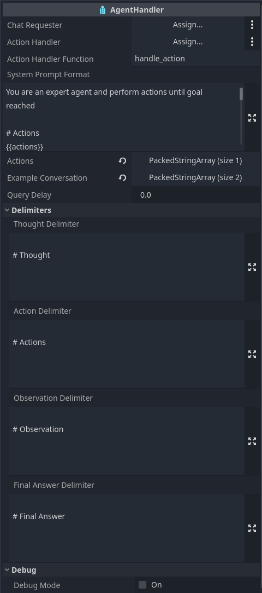
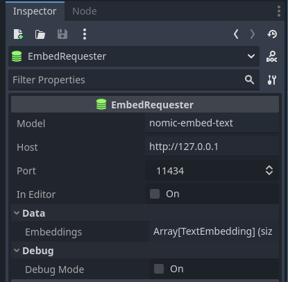

# Create LLM powered applications in Godot
Gopilot Utils offers three nodes to simplify the creation proccess of AI driven experiences
### ChatRequester

Use the ChatRequester for chat, and single-turn interactions.  
The `generate()` and `send_message` methods make chatting a breeze!
Even easier: Simply write `var response = await chat_requester.generate("Your prompt here")` and you immediately get the response, once it is finished.

[Here a guide on how to use this node](https://youtu.be/6xLmb8PtRro)
### AgentHandler

You want an agent in your project using the ReAct (Reason -> Act -> Observe -> Reason ...) workflow? No problem!
Simply add the actions in the inspector, handle the action string in a function, and the returned result becomes the observation.

[Here a guide on how to use the AgentHandler in combination with the ChatRequester](https://youtu.be/2-jRskTdIR0)

### EmbedRequester

Want to dive deeper and use semantic similarily analysis for RAG applications? The EmbedRequester makes this easy, with just a few methods!
